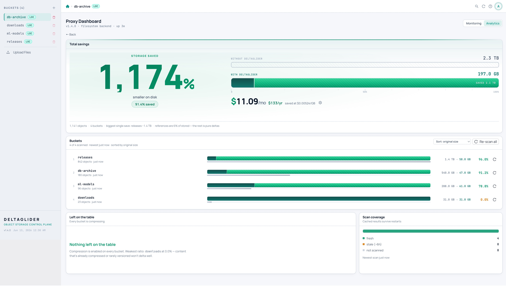

# DeltaGlider Proxy

**Not another object store or storage cluster: DeltaGlider is the S3 control plane in front of the storage you already run. It routes buckets across existing backends and local filesystems, adds a proper, centralized admin UI for IAM, OAuth, lifecycle, replication, event outbox delivery, audits, caching, and encryption, and reduces storage growth for repeated binaries with xdelta3 deltas. One binary. One port. Existing S3 workflows.**

---

## Why DeltaGlider

Organizations run storage across multiple providers — AWS S3, lower-cost S3-compatible SaaS, Hetzner Object Storage, Backblaze B2, MinIO, local NFS. Each has its own credentials, endpoints, and access policies. Teams share credentials in Slack. There's no audit trail. No prefix-level access control. No way to publish a folder without exposing the whole bucket.

DeltaGlider Proxy solves this by sitting in front of all your backends and presenting a single, authenticated S3 endpoint. It is not trying to be the distributed object store; it is the policy, routing, cache, lifecycle, replication, event, audit, encryption, and compression layer operators usually have to stitch together around one:

```
                                          ┌──────────────────────┐
                                     ┌───▶│  AWS S3 (us-east-1)  │
┌──────────────┐    ┌─────────────┐  │    └──────────────────────┘
│  S3 clients  │───▶│ DeltaGlider │──┤    ┌──────────────────────┐
│  (unchanged) │    │    Proxy    │──┼───▶│  Hetzner (Helsinki)  │
└──────────────┘    └─────────────┘  │    └──────────────────────┘
                                     │    ┌──────────────────────┐
                                     └───▶│  Local filesystem    │
                                          └──────────────────────┘
```

Clients see standard S3. They don't know which backend stores their bucket. They don't know repeated binaries are stored as compact deltas or encrypted before an untrusted backend sees them. They authenticate once — with corporate SSO if you want — and the proxy handles the rest.


---

## Core Capabilities

### Unified Storage Gateway


- **Multi-backend routing** — Route each bucket to a different storage backend (AWS S3, Hetzner, Backblaze, MinIO, filesystem). Mix and match providers behind one endpoint.
- **Bucket aliasing** — Present virtual bucket names to clients while mapping to real buckets on backends. Migrate between providers without changing a single client config.
- **Single endpoint** — Clients point at one URL. The proxy resolves which backend to use per bucket, transparently.
- **Hot-reloadable** — Add backends, change routing, update policies — all from the admin GUI, no restart needed.

### Delegated Authentication


- **OAuth/OIDC single sign-on** — Let your team log in with Google, Okta, Azure AD, or any OIDC provider. No shared S3 credentials.
- **Group mapping rules** — Automatically assign permissions based on email domain (`*@company.com`), glob patterns, regex, or identity provider claims. New hires get the right access on first login.


- **Multi-user IAM** — Per-user S3 credentials with ABAC permission rules. Allow/Deny on actions (read, write, delete, list) and resource patterns (bucket/prefix/*), with conditions (IP ranges, prefix restrictions).
- **SigV4 authentication** — Full AWS Signature V4 support, including presigned URLs up to 7 days. Compatible with every S3 SDK and CLI tool.
- **Public prefixes** — Publish specific folders (e.g. release artifacts) for anonymous download without exposing the rest of the bucket. Scoped read-only — no writes, no listing beyond the published prefix.

### Transparent Delta Compression
- **60-95% storage reduction** on repeated binary workloads when internal structure is similar across versions (backup archives, software catalogs, media/texture variants, AI model variants, release artifacts, firmware, ML checkpoints)
- Clients PUT and GET normally — the proxy intercepts, computes xdelta3 diffs against a per-prefix baseline, and stores the delta when smaller
- SHA-256 verified on every reconstructed GET — byte-identical to the original, guaranteed
- Per-bucket compression policies — enable/disable per bucket, custom ratio thresholds
- Intelligent file routing — configurable delta candidates are compressed when worthwhile; images/video/already-compressed formats pass through untouched

```
PUT releases/v2.zip ──▶ DeltaGlider ──▶ stored as 1.4MB delta (was 82MB)
GET releases/v2.zip ──▶ DeltaGlider ──▶ reconstructed, streamed back as 82MB
```

### Built-in Management GUI
Everything managed from a web UI served on the same port as the S3 API — no extra containers, no extra infrastructure:

- **File browser** — Navigate, upload, download, preview files, bulk copy/move/delete, download as ZIP
- **User management** — Create IAM users, assign ABAC permissions, rotate keys, organize into groups
- **OAuth configuration** — Add identity providers, configure group mapping rules, test SSO flows
- **Backend management** — Add/remove storage backends, configure per-bucket routing, aliasing, compression policies, and public prefixes
- **Bucket controls** — Configure soft quotas, read-only bucket freeze, public prefixes, aliases, and compression policy
- **Object lifecycle** — Preview and run delete-only expiration rules, with scheduler history/failures and engine-routed deletes
- **Object replication** — Configure source → destination replication rules, scheduler cadence, run-now, pause/resume, history/failures, and delete replication
- **Event outbox** — Durable object mutation events with background webhook delivery, fan-out endpoints, retry backoff, and failed-row requeue
- **Monitoring dashboard** — Live Prometheus metrics: request rates, latencies, cache hit rates, status codes, auth events
- **Storage analytics** — Per-bucket savings breakdown, estimated monthly cost savings, compression opportunity detection
- **Embedded documentation** — Full-text searchable reference docs with architecture diagrams




### Enterprise Security


- **Mandatory authentication** — proxy refuses to start without credentials (no accidental open deployments)
- **Encrypted config database** — IAM users and OAuth config stored in SQLCipher-encrypted database, synced across instances via S3
- **Proxy-side encryption** — AES-256-GCM before data reaches the backend; useful for cheap or untrusted S3-compatible storage where keys must stay in your environment
- **Per-IP rate limiting** — progressive delay and lockout on auth endpoints (brute-force resistant)
- **Session hardening** — IP binding, configurable TTL, max concurrent sessions, SameSite/Secure cookies
- **SigV4 replay detection** — constant-time signature comparison, clock skew validation
- **Anti-fingerprinting** — server identity headers suppressed by default
- **Audit logging** — every access logged with user, IP, action, and resource
- **TLS support** — optional, auto-detects secure cookies

---

## Quick Start

The proxy refuses to start without credentials (preventing accidentally open deployments). Supply them or explicitly opt into open access:

```bash
docker run -p 9000:9000 \
  -e DGP_ACCESS_KEY_ID=admin \
  -e DGP_SECRET_ACCESS_KEY=changeme \
  beshultd/deltaglider_proxy
```

Then point any S3 client at `http://localhost:9000`:

```bash
export AWS_ENDPOINT_URL=http://localhost:9000
aws s3 mb s3://builds
aws s3 cp v1.zip s3://builds/releases/v1.zip
aws s3 cp v2.zip s3://builds/releases/v2.zip   # stored as delta
aws s3 cp s3://builds/releases/v2.zip ./v2.zip  # full file back, byte-identical
```

Admin GUI at `http://localhost:9000/_/` — same port, zero setup. On first run, the bootstrap password is auto-generated and printed to stderr; override with `DGP_BOOTSTRAP_PASSWORD_HASH` or the `--set-bootstrap-password` flag.

## Configuration

YAML config file (canonical) or environment variables (`DGP_*` prefix). A five-line config is runnable:

```yaml
# deltaglider_proxy.yaml
storage:
  s3: https://s3.example.com
  access_key_id: admin
  secret_access_key: changeme
```

The canonical format has four optional top-level sections — `admission`, `access`, `storage`, `advanced` — each independently optional. Fields equal to their defaults are omitted from exports to keep GitOps diffs small.

```yaml
admission:
  blocks:
    - name: deny-bad-ips
      match:
        source_ip_list: ["203.0.113.0/24"]
      action: deny

access:
  access_key_id: admin
  secret_access_key: changeme
  # iam_mode: gui          # (default) encrypted IAM DB is source of truth
  # iam_mode: declarative  # YAML owns IAM; admin-API mutations return 403

storage:
  default_backend: primary
  backends:
    - name: primary
      type: s3
      endpoint: https://s3.us-east-1.amazonaws.com
      region: us-east-1
    - name: europe
      type: s3
      endpoint: https://hel1.your-objectstorage.com
      region: hel1
  buckets:
    releases:
      backend: europe
      compression: true
      public_prefixes: ["builds/", "artifacts/"]
      quota_bytes: 10737418240
    docs-site:
      public: true                  # shorthand for public_prefixes: [""]
    archive:
      backend: primary
      alias: prod-archive-2024
      compression: false

advanced:
  cache_size_mb: 2048
  log_level: deltaglider_proxy=info,tower_http=warn
```

**Offline validation** — run before committing to CI:

```sh
deltaglider_proxy config lint deltaglider_proxy.yaml
```

**Migration from TOML**: TOML still loads but emits a deprecation warning on every startup. Convert with:

```sh
deltaglider_proxy config migrate deltaglider_proxy.toml --out deltaglider_proxy.yaml
```

Silence the warning mid-migration with `DGP_SILENCE_TOML_DEPRECATION=1`. See the [upgrade guide](docs/product/21-upgrade-guide.md).

**Examples**: [deltaglider_proxy.example.yaml](deltaglider_proxy.example.yaml) (canonical). The legacy [deltaglider_proxy.toml.example](deltaglider_proxy.toml.example) is kept for reference only.

**Admin API for GitOps** — full-document apply, per-section PATCH (RFC 7396 merge-patch), JSON Schema export, and an admission-chain trace endpoint. See the [admin API reference](docs/product/reference/admin-api.md).

## S3 Compatibility

| | Operations |
|-|------------|
| **Objects** | PutObject, GetObject, HeadObject, DeleteObject, CopyObject |
| **Listing** | ListObjectsV2 (start-after, encoding-type, fetch-owner, continuation tokens) |
| **Buckets** | CreateBucket, HeadBucket, DeleteBucket, ListBuckets |
| **Multipart** | Create, UploadPart, Complete, Abort, ListParts, ListUploads |
| **Auth** | SigV4 header + presigned URLs, per-user IAM, OAuth/OIDC, public prefixes |
| **Conditional** | If-Match, If-None-Match (304), If-Modified-Since, If-Unmodified-Since (412) |
| **Range** | Range requests (206 Partial Content) |
| **Validation** | Content-MD5 on PUT/UploadPart |
| **Lifecycle** | Delete-only expiration rules via scheduler, preview, run-now, and history/failures |

Not implemented: versioning, storage-class transitions, object lock.

## Architecture

Single Rust binary. Async throughout (Tokio + axum). Single port serves S3 API on `/` and admin UI + APIs under `/_/`.

```
S3 request
  → SigV4 auth / OAuth session / public prefix bypass
  → IAM authorization (ABAC with conditions)
  → Multi-backend routing (virtual bucket → real backend + bucket)
  → FileRouter (delta-eligible vs passthrough)
  → DeltaGlider engine (compress / reconstruct / cache)
  → StorageBackend (filesystem, S3, or routed)
```

## Docker

Multi-arch images (amd64 + arm64) published on every release:

```bash
docker run -p 9000:9000 beshultd/deltaglider_proxy
```

## Kubernetes / Helm

The chart lives in [`charts/deltaglider-proxy`](charts/deltaglider-proxy):

```bash
helm upgrade --install dgp ./charts/deltaglider-proxy \
  --namespace dgp \
  --create-namespace
```

Port-forward:

```bash
kubectl -n dgp port-forward svc/dgp-deltaglider-proxy 9000:9000
```

Open the admin UI at `http://127.0.0.1:9000/_/`.

The default development bootstrap password is `change-me-in-production`; do not expose that install outside localhost. For production, create a Kubernetes Secret outside Helm with stable `DGP_ACCESS_KEY_ID`, `DGP_SECRET_ACCESS_KEY`, `DGP_BOOTSTRAP_PASSWORD_HASH`, and any backend credentials, then install with:

```bash
helm upgrade --install dgp ./charts/deltaglider-proxy \
  --namespace dgp \
  --create-namespace \
  --set auth.createSecret=false \
  --set auth.existingSecret=deltaglider-secrets
```

The chart mounts config at `/data/deltaglider_proxy.yaml` so the encrypted IAM DB is created at `/data/deltaglider_config.db` on the PVC. Full guide: [Kubernetes / Helm deployment](docs/product/22-kubernetes-helm.md).

## Documentation

Operator-facing docs are also bundled into the running binary at `/_/docs/`. Source files:

**Getting started:**
- [Quickstart](docs/product/01-quickstart.md) — install, first run, first upload.
- [Setting up a bucket](docs/product/10-first-bucket.md) — backend routing, aliases, public prefixes.

**Production:**
- [Production deployment](docs/product/20-production-deployment.md) — TLS, cache sizing, backups, multi-instance sync.
- [Security checklist](docs/product/20-production-security-checklist.md) — SigV4, IAM, rate limiting.
- [Upgrade guide](docs/product/21-upgrade-guide.md) — upgrade workflow and TOML → YAML migration.
- [Kubernetes / Helm deployment](docs/product/22-kubernetes-helm.md) — kind hello world, chart values, Secrets, PVC layout, Ingress, and probes.

**Authentication:**
- [OAuth / OIDC setup](docs/product/auth/30-oauth-setup.md)
- [SigV4 and IAM users](docs/product/auth/31-sigv4-and-iam.md)
- [IAM conditions](docs/product/auth/32-iam-conditions.md)
- [Rate limiting](docs/product/auth/33-rate-limiting.md)

**Day 2:**
- [Monitoring and alerts](docs/product/40-monitoring-and-alerts.md)
- [Troubleshooting](docs/product/41-troubleshooting.md)
- [FAQ](docs/product/42-faq.md)

**Reference:**
- [Configuration](docs/product/reference/configuration.md) · [Admin API](docs/product/reference/admin-api.md) · [Authentication](docs/product/reference/authentication.md) · [Metrics](docs/product/reference/metrics.md) · [How delta works](docs/product/reference/how-delta-works.md) · [Replication](docs/product/reference/replication.md) · [Lifecycle](docs/product/reference/lifecycle.md) · [Event outbox](docs/product/reference/event-outbox.md)

**Contributor-only** (not in the binary):
- [Contributing](docs/dev/contributing.md) · [Releasing](docs/dev/releasing.md) · [CI infrastructure](docs/dev/ci-infra.md) · [Historical design docs](docs/dev/historical/)

## License

[GPL-3.0](LICENSE). Contributors must sign the [Contributor License
Agreement](CLA.md), which assigns copyright to Beshu Limited so the
project can be dual-licensed (open source + commercial). A bot will
prompt you to sign on your first pull request.
