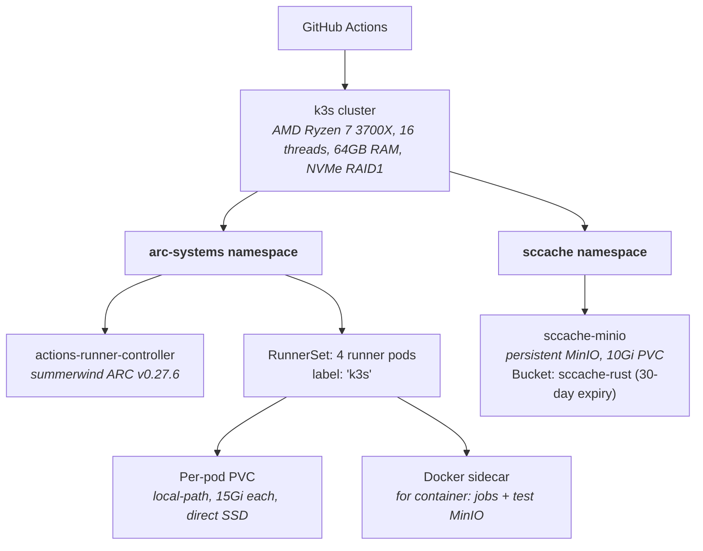
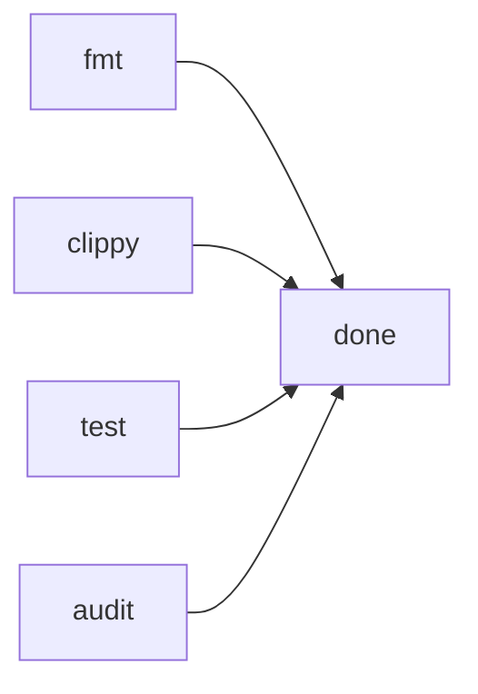
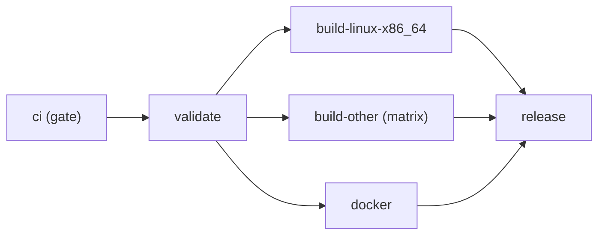

# CI Infrastructure

*Build, test, and deployment pipeline*

This document describes the self-hosted CI infrastructure for DeltaGlider Proxy, the design decisions behind it, and how to reproduce or adapt this setup for other Rust projects.

## Architecture Overview



All CI jobs run inside a custom **builder image** (`ghcr.io/beshu-tech/deltaglider_proxy/builder:latest`) pulled as a `container:` job. The image is based on Ubuntu 24.04 with all tools pre-installed: Rust stable, Node.js 20, clippy, rustfmt, cargo-audit, cargo-sbom, sccache, xdelta3, Docker CLI, and MinIO client (mc).

## Performance Evolution

We iterated through four configurations. Here is how each CI job performed:

### Pipeline Total (wall time, warm cache)

| Configuration | Clippy | Tests | Audit | Fmt | Pipeline |
|---|---|---|---|---|---|
| GitHub Hosted (baseline) | 46s | 2m30s | 2m59s | 9s | ~6m24s |
| k3s + emptyDir + rust-cache | 2m06s | 3m53s | 45s | 35s | ~6m59s |
| k3s + PVC + rust-cache | 1m59s | 3m18s | 29s | 1s | ~3m22s |
| **k3s + PVC + sccache (current)** | **27s** | **1m45s** | **3s** | **1s** | **~2m48s** |

### What changed at each step

| Step | Change | Impact |
|---|---|---|
| Baseline to k3s | Moved from GitHub-hosted to self-hosted k3s | Slower: overlay2 FS penalty killed compilation I/O |
| emptyDir to PVC | RunnerSet with per-pod PVCs via local-path provisioner | 14x faster Clippy: overlay2 bypass, direct SSD access |
| VM resource bump | 4 CPU/8GB RAM/30GB disk to 8 CPU/16GB RAM/80GB disk | More parallelism for `cargo`, no disk pressure |
| rust-cache to sccache | Local MinIO instead of GitHub's remote cache API | Eliminated 57-86s cache restore/save round-trips per job |

### Detailed step-level breakdown (warm sccache)

| Step | Clippy | Tests |
|---|---|---|
| Initialize container | 21s | 22s |
| Checkout | 1s | 1s |
| Cache restore | **0s** | **0s** |
| Demo UI build (npm) | 23s | 23s |
| **Cargo command** | **27s** | **1m45s** |
| Cache save | **0s** | **0s** |

With sccache, the cache restore/save steps disappear entirely. sccache fetches individual crate compilation artifacts inline during the build from the local MinIO with ~0ms network latency.

## Components

### 1. Builder Image

**Location:** `.github/builder/Dockerfile`
**Registry:** `ghcr.io/beshu-tech/deltaglider_proxy/builder:latest`
**Workflow:** `.github/workflows/builder-image.yml` (auto-rebuilds on push to `.github/builder/`)

The image is a plain Ubuntu 24.04 with every tool pre-installed. This means zero on-the-fly downloads during CI jobs.

**Included tools:**
- Rust stable (minimal profile: no docs, no man pages)
- rustfmt, clippy
- cargo-audit, cargo-sbom, sccache
- Node.js 20 + npm
- xdelta3
- Docker CLI (static binary, not the daemon)
- MinIO client (mc)

**Size optimization:**
- `--profile minimal` for rustup (skips docs/man)
- Static Docker CLI binary (~50MB) instead of full apt package (~300MB)
- `rm -rf "$CARGO_HOME"/registry "$CARGO_HOME"/git` after installing cargo tools
- Total image size: ~1.5GB

**When to rebuild:** Whenever you update Rust toolchain version, add/remove cargo tools, or change system dependencies. Push changes to `.github/builder/` and the workflow auto-triggers. Takes ~8-9 minutes on GitHub-hosted runners.

### 2. Self-Hosted Runners (k3s + ARC)

**Controller:** summerwind/actions-runner-controller v0.27.6
**Resource type:** RunnerSet (StatefulSet-based, supports volumeClaimTemplates)
**Manifest:** `.github/k8s/runner-set.yaml`

Key configuration:
- **4 replicas** with labels `[self-hosted, linux, x64, k3s]`
- **Per-pod PVC** via `volumeClaimTemplates` with `local-path` StorageClass
- Each runner gets its own 15Gi persistent volume on the host SSD
- The work directory (`/runner/_work`) is backed by this PVC, not emptyDir

**Why RunnerSet instead of RunnerDeployment:**
- RunnerDeployment creates pods with shared emptyDir volumes
- A shared hostPath caused file collisions when multiple runners ran concurrent jobs
- RunnerSet supports `volumeClaimTemplates`, giving each pod an isolated PVC
- This eliminates the overlay2 penalty (the single biggest performance bottleneck)

**Why per-pod PVCs matter for Rust:**
Rust compilation creates thousands of intermediate files (`.o`, `.rlib`, `.rmeta`) in the `target/` directory. With overlay2 (the default for emptyDir in container jobs), every write triggers a copy-on-write operation. On a project with ~80 crates, this added minutes to compilation. Direct SSD access via PVC bypasses this entirely.

**Open-file limit (`nofile`) — REQUIRED, both host and workflow:**
The runners execute inside **Ryzen LXC containers** (the `k3s` label is a historical
alias — there is no Kubernetes anymore). An LXC container inherits a **low default
`nofile` (~1024)** unless raised. The integration job runs **~35 test binaries in one
`cargo test` invocation**, each spawning its own proxy + MinIO sockets, so the *aggregate*
open-fd count easily crosses 1024 and surfaces — non-deterministically, under load — as:

```
ConnectError("tcp open error", Os { code: 24, message: "Too many open files" })
```

It typically panics mid-seed in whichever test opens the most connections (historically
`recursive_delete_test`, which seeds 1100 objects), but the root cause is the shared,
under-sized fd table, not any single test. Two layers fix it (keep BOTH):

1. **Host side (the real fix).** On the Ryzen host, raise the LXC container's limit so
   everything inside inherits it. Run the idempotent helper as root on the host:
   ```
   sudo scripts/bump-runner-nofile.sh            # auto-detects LXC/Incus/LXD containers
   sudo scripts/bump-runner-nofile.sh ct1 ct2    # or name them explicitly
   ```
   It sets `lxc.prlimit.nofile` (or the Incus/LXD `limits.kernel.nofile` equivalent) and
   pins `LimitNOFILE` on the in-container `actions-runner` systemd unit. Equivalent manual
   steps:
   ```
   # /var/lib/lxc/<container>/config
   lxc.prlimit.nofile = 1048576
   # systemctl edit actions-runner   →   [Service]
   LimitNOFILE=1048576
   ```
   Restart the container afterwards (`lxc-stop && lxc-start`, or `incus restart`). Verify
   from a job step: `ulimit -Sn; ulimit -Hn; cat /proc/sys/fs/file-max`.

2. **Workflow side (belt-and-suspenders, self-documenting).** Every `container:` block in
   `ci.yml` sets `options: --ulimit nofile=1048576:1048576`. This makes the requirement
   visible to future readers and keeps the workflow portable to a fresh runner host that
   hasn't had the host-side bump applied yet. (It only takes effect up to the host's hard
   limit, so the host bump in #1 is still authoritative.)

Tests should also avoid unbounded N-way connection fan-out (cap seeding with a
`tokio::sync::Semaphore`) so a single test can't dominate the shared fd budget — but that
is hygiene, not a substitute for the limit bump.

### 3. sccache + Local MinIO

**Manifest:** `.github/k8s/sccache-minio.yaml`
**Namespace:** `sccache` (dedicated, clearly separated from application workloads)
**Service:** `sccache-minio.sccache.svc.cluster.local:9000`
**Bucket:** `sccache-rust` with 30-day object expiration lifecycle rule

sccache is a Rust compilation cache that operates at the individual crate level. Unlike `Swatinem/rust-cache` (which uploads/downloads a bulk snapshot of `target/` from GitHub's remote cache servers), sccache:

1. Intercepts each `rustc` invocation via `RUSTC_WRAPPER=sccache`
2. Computes a hash of the compiler + flags + source files
3. Checks the local MinIO bucket for a cached result
4. On hit: returns the cached `.rlib` without invoking the compiler
5. On miss: compiles normally, then stores the result in MinIO

**Why sccache over Swatinem/rust-cache for self-hosted runners:**

| Dimension | Swatinem/rust-cache | sccache + local MinIO |
|---|---|---|
| Cache granularity | Entire `target/` snapshot | Per-crate compilation unit |
| Storage | GitHub Actions cache API (10GB cap) | Local MinIO (no cap) |
| Restore time | 57-86s (download from GitHub) | 0s (inline during build) |
| Save time | 1-5s (upload to GitHub) | 0s (inline during build) |
| Cross-job sharing | No (each job saves its own snapshot) | Yes (all jobs share one bucket) |
| Network latency | Cross-internet to GitHub | ~0ms (same k8s cluster) |

**What sccache cannot cache:** proc-macro crates, binary crates, crates with C library builds via `build.rs`. These are compiled fresh each run but are typically a small fraction of total build time.

**Environment variables** (set at workflow level in `ci.yml` and `release.yml`):

```yaml
env:
  RUSTC_WRAPPER: sccache
  CARGO_INCREMENTAL: "0"          # required by sccache
  SCCACHE_BUCKET: sccache-rust
  SCCACHE_ENDPOINT: http://sccache-minio.sccache.svc.cluster.local:9000
  SCCACHE_REGION: auto
  SCCACHE_S3_USE_SSL: "false"
  AWS_ACCESS_KEY_ID: sccache
  AWS_SECRET_ACCESS_KEY: sccache-secret-key
```

Jobs that don't compile Rust (fmt, audit) override `RUSTC_WRAPPER: ""` at the step level.

### 4. Test MinIO (Ephemeral)

Integration tests need an S3-compatible backend. A **separate, ephemeral** MinIO instance is started per test job:

```yaml
- name: Start MinIO for tests
  run: |
    # Ephemeral MinIO for integration tests — NOT the sccache MinIO
    docker run -d --name minio-ci --network container:$(hostname) \
      -e MINIO_ROOT_USER=minioadmin \
      -e MINIO_ROOT_PASSWORD=minioadmin \
      minio/minio:latest server /data
```

The `--network container:$(hostname)` flag shares the runner pod's network namespace with the MinIO container, making it reachable at `localhost:9000` from the job container. This is necessary because GitHub Actions `container:` jobs run inside Docker, and `services:` cannot pass CMD arguments (MinIO needs `server /data`).

**This MinIO is completely separate from the sccache MinIO.** Different namespace, different credentials, different lifecycle. It is destroyed at the end of every test job.

## Workflow Files

| File | Purpose | Runs on |
|---|---|---|
| `ci.yml` | fmt, clippy, test, audit | k3s (all jobs) |
| `release.yml` | validate, build, Docker push, GitHub Release | k3s (x86_64), Blacksmith (ARM), macOS (Apple) |
| `builder-image.yml` | Rebuild the CI builder image | GitHub-hosted (ubuntu-latest) |

### CI Pipeline (`ci.yml`)



All four jobs run concurrently on separate runner pods. Each uses the builder image as a `container:` job.

### Release Pipeline (`release.yml`)



- `build-linux-x86_64`: k3s with sccache (fastest)
- `build-other` (ARM Linux, macOS): GitHub-hosted/Blacksmith with `Swatinem/rust-cache` (can't reach local MinIO)
- `docker`: k3s, uses Docker buildx with GHA cache

## How to Reproduce This Setup

### Prerequisites

1. A server with a fast SSD (NVMe preferred) and decent CPU (8+ threads)
2. k3s installed (or any Kubernetes distribution)
3. summerwind/actions-runner-controller deployed
4. A GitHub organization or repository with self-hosted runner access

### Step 1: Create the Builder Image

1. Create `.github/builder/Dockerfile` with your project's tool requirements
2. Create `.github/workflows/builder-image.yml` to auto-build on push
3. Push and wait for the image to appear on GHCR
4. Make the GHCR package public (Settings > Packages > Visibility)

**Tips:**
- Use `--profile minimal` for rustup to save ~500MB
- Use static Docker CLI binary instead of the apt package
- Clean `$CARGO_HOME/registry` and `$CARGO_HOME/git` after installing cargo tools
- Run a verification step at the end to catch missing tools early

### Step 2: Set Up the k3s VM

Allocate enough resources. Our starting config (4 CPU, 8GB RAM, 30GB disk) was too constrained:
- Compilation was CPU-limited (4 cores for `cargo` is slow)
- 30GB disk filled up with Docker images
- 8GB RAM was tight with the linker + MinIO + 4 runner pods

**Recommended minimums for a Rust CI workload:**

| Resource | Minimum | Recommended |
|---|---|---|
| CPU | 4 cores | 8+ cores |
| RAM | 8 GB | 16 GB |
| Disk | 50 GB | 80+ GB |

### Step 3: Deploy Runners with Per-Pod PVCs

Use a **RunnerSet** (not RunnerDeployment) to get `volumeClaimTemplates`:

```yaml
apiVersion: actions.summerwind.dev/v1alpha1
kind: RunnerSet
metadata:
  name: my-runner-set
  namespace: arc-systems
spec:
  replicas: 4
  selector:
    matchLabels:
      app: my-runner
  serviceName: my-runner
  template:
    metadata:
      labels:
        app: my-runner
    spec:
      containers: []
  labels:
    - self-hosted
    - linux
    - x64
    - k3s
  organization: my-org
  group: Default
  volumeClaimTemplates:
    - metadata:
        name: work
      spec:
        storageClassName: local-path
        accessModes: [ReadWriteOnce]
        resources:
          requests:
            storage: 15Gi
```

**Critical:** Do not use a shared `hostPath` for the work directory. Multiple runner pods writing to the same path causes file lock collisions (`actions/checkout` and the cache both write to `_work/_actions/`). Per-pod PVCs solve this.

### Step 4: Deploy sccache MinIO

Deploy a persistent MinIO instance in its own namespace with clear labeling:

```bash
kubectl apply -f .github/k8s/sccache-minio.yaml
```

Then create the bucket and lifecycle rule:

```bash
kubectl run minio-setup --image=minio/mc:latest --restart=Never \
  --namespace=sccache --command -- sh -c '
    mc alias set sccache http://sccache-minio:9000 sccache sccache-secret-key &&
    mc mb --ignore-existing sccache/sccache-rust &&
    mc ilm rule add sccache/sccache-rust --expire-days 30
  '
```

**Labeling matters.** Use a dedicated namespace (`sccache`), distinctive credentials (not `minioadmin`), and clear annotations. You will likely have other MinIO instances (test, application). Making them visually and operationally distinct prevents accidents.

### Step 5: Configure Workflows

Add sccache environment variables at the workflow level:

```yaml
env:
  RUSTC_WRAPPER: sccache
  CARGO_INCREMENTAL: "0"
  SCCACHE_BUCKET: sccache-rust
  SCCACHE_ENDPOINT: http://sccache-minio.sccache.svc.cluster.local:9000
  SCCACHE_REGION: auto
  SCCACHE_S3_USE_SSL: "false"
  AWS_ACCESS_KEY_ID: sccache
  AWS_SECRET_ACCESS_KEY: sccache-secret-key
```

Override `RUSTC_WRAPPER: ""` for jobs that don't compile (fmt, audit) and for jobs on non-k3s runners that can't reach the local MinIO.

## Troubleshooting

### "No space left on device" during image pull

The k3s VM disk is too small. Expand it:
```bash
incus config device set k3s root size=80GB
incus restart k3s
# Inside VM: growpart /dev/sda 2 && resize2fs /dev/sda2
```

### Runner pods in Error state after volume change

Multiple Docker sidecars sharing the same `hostPath` for `/var/lib/docker` will fight over the boltdb lock. Each pod needs its own Docker storage. Either use emptyDir (default) or ensure unique paths per pod.

### "The process cannot access the file" during checkout

Multiple runner pods share the same work directory. Switch from RunnerDeployment with shared hostPath to RunnerSet with per-pod PVCs.

### sccache misses on every build

Check that the MinIO endpoint is reachable from inside the `container:` job:
```bash
# From inside a CI step
curl -s http://sccache-minio.sccache.svc.cluster.local:9000/minio/health/ready
sccache --show-stats
```

The `container:` job shares the runner pod's network namespace, so k8s DNS and ClusterIP services are accessible.

### Test MinIO unreachable at localhost:9000

The ephemeral test MinIO must share the runner pod's network namespace:
```bash
docker run -d --network container:$(hostname) minio/minio:latest server /data
```

Do **not** use `--network host` — that puts MinIO on the k3s node's network, not the pod's.

## Alternatives Considered

### GitHub Hosted Runners

- Free for public repos, zero maintenance
- Slower CPUs, remote cache, no infra ownership
- Good default; switch to self-hosted only when speed matters

### Blacksmith (blacksmith.sh)

- Gaming-grade CPUs (Passmark ~4479 single-thread), 4x faster cache
- Drop-in replacement: just change `runs-on:` label
- $0.004/min, 3000 free min/month
- Best option if you don't want to maintain infrastructure

### Swatinem/rust-cache (without sccache)

- Simple: one `uses:` line in the workflow
- Works on any runner (hosted or self-hosted)
- Bottleneck: bulk upload/download of `target/` snapshot over the internet
- Keep it for jobs on GitHub-hosted runners that can't reach local MinIO

## File Reference

```
.github/
  builder/
    Dockerfile              # CI builder image definition
  k8s/
    runner-set.yaml         # RunnerSet manifest (reference)
    sccache-minio.yaml      # sccache MinIO deployment (reference)
  workflows/
    builder-image.yml       # Auto-rebuild builder image
    ci.yml                  # CI pipeline (fmt, clippy, test, audit)
    release.yml             # Release pipeline (build, Docker, GitHub Release)
```
