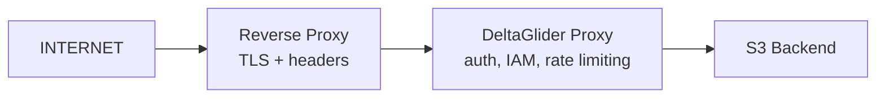

# Security Basics

*Step-by-step guide from open access to production security*

A step-by-step guide to taking your proxy from open access to production-ready security. Each step explains **what** to configure, **why** it matters, and shows the exact configuration.

## Before You Start

A fresh DeltaGlider Proxy installation **refuses to start** without authentication credentials. To run in open access mode for local development, you must explicitly set `authentication = "none"` in the config or `DGP_AUTHENTICATION=none` as an environment variable. This is never acceptable in production. This guide walks you through each security layer.



---

## Step 1: Enable SigV4 Authentication

**What:** Require all S3 clients to sign requests with AWS SigV4 signatures.

**Why:** Without this, anyone who can reach your proxy can read, write, and delete all data. SigV4 is the standard S3 authentication mechanism — all S3 clients and SDKs support it natively.

```yaml
# deltaglider_proxy.yaml
access:
  access_key_id: my-proxy-key
  secret_access_key: my-super-secret-key-change-me
```

```bash
# Or via environment variables
DGP_ACCESS_KEY_ID=my-proxy-key
DGP_SECRET_ACCESS_KEY=my-super-secret-key-change-me
```

**Verify:** After restart, unauthenticated requests return `403 AccessDenied`:

```bash
# This should fail with AccessDenied
curl http://localhost:9000/

# This should succeed
aws s3 ls --endpoint-url http://localhost:9000
# (using ~/.aws/credentials with the key above)
```

**Client configuration example (AWS CLI):**

```bash
aws configure
# Access Key ID: my-proxy-key
# Secret Access Key: my-super-secret-key-change-me
# Region: us-east-1 (any value works)
```

---

## Step 2: Set a Bootstrap Password

**What:** The bootstrap password encrypts the IAM database, signs admin session cookies, and gates admin GUI access.

**Why:** Without it, one is auto-generated and printed to stderr on first run. If you lose it, you lose access to the IAM database. Setting it explicitly ensures you control it.

```bash
# Generate a password and get the hash
./deltaglider_proxy --set-bootstrap-password
# Enter password: ********
# Hash: $2b$12$...
# Base64: JDJiJDEy...
```

```yaml
# deltaglider_proxy.yaml
advanced:
  bootstrap_password_hash: "JDJiJDEyJENYbDVPRm84bDg2..."
```

```bash
# For Docker (avoids $ escaping issues), use base64 form
DGP_BOOTSTRAP_PASSWORD_HASH=JDJiJDEyJENYbDVPRm84bDg2...
```

> Note: infra secrets (bootstrap hash, every per-backend encryption key + any `legacy_key` shim) are stripped from canonical exports (`/config/export`, `config migrate`) — they never round-trip through the YAML artifact. Inject them via env var at deploy time. Non-secret identifiers (`key_id`, `kms_key_id`) DO survive redaction so operators can see which backend uses which key material.

**Why base64?** Bcrypt hashes contain `$` characters which Docker, docker-compose, and shell scripts interpret as variable references. The base64 form avoids this entirely.

---

## Step 3: Create IAM Users


**What:** Move from a single shared credential to per-user access keys with fine-grained permissions.

**Why:** Shared credentials can't be revoked individually. If a CI pipeline's key leaks, you'd have to change the key for everyone. IAM users let you rotate keys per-user and restrict access to specific buckets/prefixes.

1. Open the admin GUI at `http://your-proxy:9000/_/`
2. Log in with the bootstrap password
3. Go to **Users** tab
4. Click **Create User**
5. Set permissions:

> [!TIP] Example Profile: CI Pipeline User
> **Username:** `ci-builder`
> **Access Key:** *(auto-generated)*
> 
> **Permissions Rules:**
> 1. `Allow` | Actions: `read, write, list` | Resources: `builds/*`
> 2. `Deny`  | Actions: `delete` | Resources: `*`

**Permission examples:**

| Use case | Actions | Resources |
|----------|---------|-----------|
| Read-only access | `read, list` | `my-bucket/*` |
| CI upload | `read, write, list` | `my-bucket/builds/*` |
| Full admin | `*` | `*` |
| Read everything, no delete | `read, list` | `*` + Deny `delete` on `*` |

---

## Step 3a: Enable OAuth/OIDC (alternative to manual IAM users)

**What:** Let your team log in with their corporate identity (Google, Okta, Azure AD) instead of managing individual S3 credentials.

**Why:** No shared credentials to leak. No keys to rotate manually. New hires get access on first login. Departing employees lose access when their IdP account is disabled.

1. Open the admin GUI → **Admin Settings** → **Authentication**
2. Click **Add Provider** (e.g., Google OIDC)
3. Enter Client ID, Client Secret, and Issuer URL from your identity provider
4. Add **Mapping Rules** to auto-assign permissions:
   - `email_domain = "company.com"` → add to `developers` group
   - `email_glob = "admin-*@company.com"` → add to `admins` group
5. Save. The login page will now show "Sign in with Google" alongside credentials.

OAuth users get auto-provisioned IAM accounts on first login. Their group memberships (and thus permissions) are updated on every subsequent login based on the mapping rules.

> [!TIP] OAuth + IAM work together
> You can have both: IAM users for CI pipelines (programmatic access) and OAuth for humans (browser access). They coexist naturally.

---

## Step 3b: Publish Public Folders (optional)

**What:** Make specific folders downloadable without any authentication.

**Why:** Release artifacts, public docs, or shared assets that should be accessible via a simple URL — no S3 credentials, no OAuth, just `curl`.

1. Go to **Admin Settings** → **Backends**
2. Find the bucket policy card (or create one)
3. Under **Public Prefixes**, add the folder paths (e.g., `builds/`, `releases/`)
4. Save

Anonymous users can now GET/HEAD/LIST objects under those prefixes. Writes still require authentication.

```bash
# Works without credentials:
curl http://your-proxy:9000/releases/builds/v1.zip -o v1.zip
```

---

## Step 4: Configure Rate Limiting


**What:** Limit how many failed authentication attempts an IP can make before being locked out.

**Why:** Without rate limiting, an attacker can brute-force credentials by trying thousands of key combinations per second. Rate limiting makes this impractical.

```
  Failed attempts over time:

  Attempt 1-10:  No delay        ──→ Normal typos
  Attempt 11:    100ms delay     ──→ Suspicious
  Attempt 12:    200ms delay     ──→
  Attempt 13:    400ms delay     ──→ Progressive slowdown
  ...                            ──→
  Attempt 17+:   5s delay (cap)  ──→ Very expensive to brute force
  Attempt 100:   LOCKOUT 10min   ──→ IP blocked entirely
```

The defaults are permissive (100 attempts, 5-minute window, 10-minute lockout). For higher security:

```bash
DGP_RATE_LIMIT_MAX_ATTEMPTS=20     # Lock out after 20 failures
DGP_RATE_LIMIT_WINDOW_SECS=600     # Count failures over 10 minutes
DGP_RATE_LIMIT_LOCKOUT_SECS=3600   # Lock out for 1 hour
```

---

## Step 5: Deploy Behind a Reverse Proxy with TLS

**What:** Terminate TLS at a reverse proxy (nginx, Caddy, Traefik) and pass client IPs via headers.

**Why:** S3 clients expect HTTPS. A reverse proxy handles certificate management, HTTP/2, and connection pooling. The proxy headers let DeltaGlider see real client IPs for rate limiting and IAM conditions.

```
  Client ──HTTPS──→ [nginx/Caddy] ──HTTP──→ [DeltaGlider :9000]
                    (TLS termination)       (trusts X-Forwarded-For)
```

**Caddy example (automatic TLS):**

```
files.example.com {
    reverse_proxy localhost:9000
}
```

**nginx example:**

```nginx
server {
    listen 443 ssl;
    server_name files.example.com;
    ssl_certificate /etc/ssl/certs/proxy.pem;
    ssl_certificate_key /etc/ssl/private/proxy-key.pem;

    location / {
        proxy_pass http://127.0.0.1:9000;
        proxy_set_header X-Forwarded-For $proxy_add_x_forwarded_for;
        proxy_set_header X-Real-IP $remote_addr;
        proxy_set_header Host $host;
    }
}
```

**DeltaGlider configuration:**

```bash
# Trust proxy headers (default: false — set true ONLY when behind a
# trusted reverse proxy that sets X-Forwarded-For / X-Real-IP)
DGP_TRUST_PROXY_HEADERS=true

# Require HTTPS for session cookies
DGP_SECURE_COOKIES=true
```

**IMPORTANT:** If the proxy is exposed directly to the internet (no reverse proxy), set `DGP_TRUST_PROXY_HEADERS=false`. Otherwise, attackers can spoof their IP to bypass rate limiting.

---

## Step 6: Enable Encryption at Rest (optional)

**What:** Pick an encryption mode per storage backend. Four choices: `none` (plaintext), `aes256-gcm-proxy` (proxy-side AES-256-GCM), `sse-kms` (AWS KMS), `sse-s3` (AWS-managed AES256).

**Why:** If someone walks off with the disks — or your S3 backend is breached at the storage layer — the ciphertext is useless without the key. Metadata (object names, sizes, compression ratios) stays unencrypted.

Configure per-backend in the admin GUI:

1. Admin → **Configuration** → **Storage** → **Backends**
2. On each backend card, pick an encryption mode from the dropdown:
   - **None** — plaintext. Appropriate for public-CDN buckets.
   - **AES-256-GCM (proxy-side)** — the proxy encrypts before the backend sees anything. Generate a 256-bit key in-browser; copy it to a secret manager; check "I have stored this key safely"; Apply.
   - **SSE-KMS** — paste the KMS ARN. AWS encrypts on write and decrypts on read for callers with KMS permission. The proxy never handles key material.
   - **SSE-S3** — AWS-managed AES256. No ARN; AWS picks the key.
3. Apply. The change takes effect on the next write to that backend.

Alternatively, via env var (recommended for proxy-AES — keeps the key out of the YAML artifact):

```bash
# For a named backend:
DGP_BACKEND_EU_ARCHIVE_ENCRYPTION_KEY=$(openssl rand -hex 32)
# For the singleton-backend deployment (no `backends:` list):
DGP_ENCRYPTION_KEY=$(openssl rand -hex 32)
```

> [!WARNING] If you lose a proxy-AES key, encrypted objects on that backend are unrecoverable.
> DeltaGlider does not escrow keys. There is no recovery path. Store each key somewhere outside the proxy host — a secrets manager, an operator password vault, a sealed envelope. SSE-KMS / SSE-S3 keys are AWS-managed; the risk surface is your IAM and KMS story.

**Caveats:**
- **Rotation within one mode is not automated.** Rotating a proxy-AES key via the admin GUI requires either a `legacy_key` shim (to keep reading old objects) or a full copy-through-the-proxy migration to a new backend.
- **Only new writes are encrypted.** Switching a backend's mode does not retroactively encrypt existing objects.
- **Mode transitions (proxy-AES → SSE-KMS) use a decrypt-only shim.** The admin panel shows an info banner; clear `legacy_key` once historical objects are gone.
- **Per-bucket encryption is not supported.** Encryption is a backend-scoped choice; buckets inherit the encryption of the backend they route to. Operators who need bucket-level isolation create additional backends.

**Large objects (proxy-AES only):** Downloads stream end-to-end with ~130 KiB peak RAM regardless of object size; range GETs fetch only the target chunks (O(1) traffic). Uploads buffer the ciphertext in memory (~1× plaintext size) before handing off to the backend; the proxy's `max_object_size` default of 100 MiB keeps that bounded. Bumping `max_object_size` for large encrypted uploads means budgeting RAM to match. SSE-KMS / SSE-S3 have no such overhead.

**What's encrypted vs. what isn't** (mode-dependent body encryption; metadata is always plaintext):

| Layer | `none` | `aes256-gcm-proxy` | `sse-kms` / `sse-s3` |
|---|---|---|---|
| Object body (passthrough) | No | Yes — chunked AES-256-GCM | Yes — AWS-side |
| Delta body + reference body | No | Yes — single-shot AES-256-GCM | Yes — AWS-side |
| Object name / size / metadata | No | No | No |
| Transport (network) | Configure TLS at reverse proxy (Step 5) | same | same |

For the per-mode wire format, key-id mismatch detection, and the decrypt-only shim mechanics, see the [encryption reference](reference/encryption-at-rest.md).

---

## Verification Checklist

After completing all steps, verify:

```bash
# 1. Unauthenticated access is denied
curl -s http://localhost:9000/ | grep AccessDenied

# 2. Authenticated access works
aws s3 ls --endpoint-url http://localhost:9000

# 3. Admin GUI is accessible
curl -s http://localhost:9000/_/api/whoami
# Should return: {"mode":"iam"} (not "open")

# 4. Rate limiting is active
# (try wrong credentials 5+ times, observe progressive delay)

# 5. TLS is working (if behind reverse proxy)
curl -s https://files.example.com/_/health
```

---

## Quick Reference

| Layer | Setting | Default | Production |
|-------|---------|---------|------------|
| Auth | `DGP_ACCESS_KEY_ID` | None (open) | Required |
| Auth | `DGP_SECRET_ACCESS_KEY` | None (open) | Required |
| Admin | `DGP_BOOTSTRAP_PASSWORD_HASH` | Auto-generated | Set explicitly |
| Rate limit | `DGP_RATE_LIMIT_MAX_ATTEMPTS` | 100 | 20-50 |
| Rate limit | `DGP_RATE_LIMIT_LOCKOUT_SECS` | 600 | 1800-3600 |
| Proxy | `DGP_TRUST_PROXY_HEADERS` | false | true (behind proxy) |
| Cookies | `DGP_SECURE_COOKIES` | true | true |
| At-rest | `DGP_ENCRYPTION_KEY` | None (plaintext) | 64-char hex (optional) |
| Debug | `DGP_DEBUG_HEADERS` | false | false |
