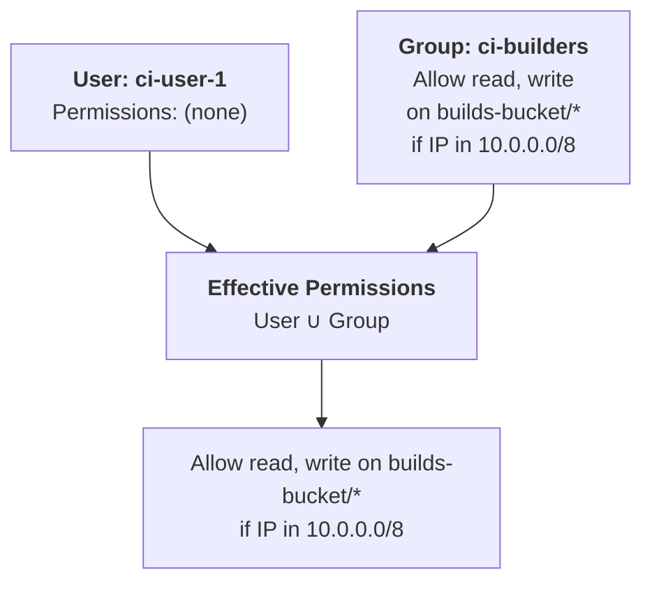

# IAM Conditions

*Advanced access control with IP and prefix restrictions*

A step-by-step guide to using IAM policy conditions for fine-grained access control. Conditions let you restrict **where** and **how** users can access data, beyond just what actions they can perform.

## Prerequisites

- DeltaGlider Proxy with authentication enabled (see [Security checklist](../20-production-security-checklist.md))
- At least one IAM user created via the admin GUI
- Basic understanding of AWS IAM concepts (Allow/Deny, actions, resources)

---

## What Are Conditions?

Standard IAM permissions answer: **"Can user X do action Y on resource Z?"**

Conditions add context: **"...but only if the request comes from this IP range"** or **"...but only if the prefix matches this pattern."**

```mermaid
flowchart TD
    R["<b>Permission Rule</b><br/><br/>Effect: Allow<br/>Actions: read, list<br/>Resources: my-bucket/*<br/><br/><b>Conditions:</b>"]
    R --> C1["aws:SourceIp = 10.0.0.0/8"]
    R --> C2["s3:prefix NOT LIKE 'internal/*'"]
    R --> S["Allow read/list on my-bucket, but only from<br/>the 10.x.x.x network, and not on the internal/ prefix"]

    style S fill:#1a3a2a,stroke:#2dd4bf
```



---

## Step 1: IP-Based Access Restrictions

**Scenario:** Your CI pipeline should only access the proxy from your build servers. If a CI credential leaks, attackers outside your network can't use it.

### Create the rule

In the admin GUI, edit the CI user's permissions:

```
Effect:    Allow
Actions:   read, write, list
Resources: builds-bucket/*
Conditions:
  IpAddress:
    aws:SourceIp: "10.0.0.0/8"
```

**How it works:**



```mermaid
flowchart TD
    A1["Request from 10.0.1.50<br/>(build server)"] --> B1{"10.0.1.50 matches<br/>10.0.0.0/8?"}
    B1 -- "Yes" --> C1["Access granted ✅"]

    A2["Request from 203.0.113.42<br/>(attacker)"] --> B2{"203.0.113.42 matches<br/>10.0.0.0/8?"}
    B2 -- "No" --> C2["Access denied ❌<br/>even with valid credentials"]

    style C1 fill:#1a3a2a,stroke:#2dd4bf
    style C2 fill:#3a1a1a,stroke:#fb7185
```

### Multiple IP ranges

```json
{
  "IpAddress": {
    "aws:SourceIp": ["10.0.0.0/8", "172.16.0.0/12", "192.168.0.0/16"]
  }
}
```

### Important: Proxy Headers

For IP conditions to work behind a reverse proxy, the proxy must forward client IPs:

```bash
# DeltaGlider trusts X-Forwarded-For by default
DGP_TRUST_PROXY_HEADERS=true
```

Your reverse proxy must set `X-Forwarded-For`:
```nginx
proxy_set_header X-Forwarded-For $proxy_add_x_forwarded_for;
```

**Warning:** If `DGP_TRUST_PROXY_HEADERS=true` and the proxy is exposed directly to the internet, clients can spoof their IP by sending a fake `X-Forwarded-For` header, bypassing IP conditions entirely.

---

## Step 2: Prefix-Based List Restrictions

**Scenario:** A user should be able to list objects in their own prefix but not see other users' files.

### Create the rule

```
Effect:    Allow
Actions:   read, write, list, delete
Resources: shared-bucket/user-alice/*

Effect:    Deny
Actions:   list
Resources: shared-bucket/*
Conditions:
  StringNotLike:
    s3:prefix: "user-alice/*"
```

For reusable per-user rules, `s3:prefix` string values also support `${username}` and `${access_key_id}`. The same expansion rules as resource patterns apply: templates are stored raw, expanded per effective user after group inheritance, and identity values are percent-encoded before substitution.

```json
{
  "StringLike": {
    "s3:prefix": ["home/${username}/*", "keys/${access_key_id}/*"]
  }
}
```

**How it works:**



```mermaid
flowchart TD
    A1["LIST s3:prefix=user-alice/docs/"] --> B1{"Allow rule matches<br/>shared-bucket/user-alice/*?"}
    B1 -- "Yes ✅" --> C1{"Deny condition:<br/>prefix NOT LIKE user-alice/*?"}
    C1 -- "No — condition not met" --> D1["Deny does NOT apply<br/>Result: ALLOWED ✅"]

    A2["LIST s3:prefix=user-bob/"] --> B2{"Allow rule matches<br/>shared-bucket/user-alice/*?"}
    B2 -- "No ❌" --> C2{"Deny rule matches<br/>shared-bucket/*?"}
    C2 -- "Yes" --> D2{"Deny condition:<br/>prefix NOT LIKE user-alice/*?"}
    D2 -- "Yes — condition met" --> E2["Result: DENIED ❌"]

    style D1 fill:#1a3a2a,stroke:#2dd4bf
    style E2 fill:#3a1a1a,stroke:#fb7185
```

### Deny listing of hidden files

Prevent any user from listing files starting with `.` (dotfiles):

```
Effect:    Deny
Actions:   list
Resources: *
Conditions:
  StringLike:
    s3:prefix: ".*"
```

---

## Step 3: Combining Conditions

Conditions within a single rule are ANDed (all must match). Multiple rules are evaluated independently with Deny taking precedence.

### Example: Geo-restricted read-only access

```mermaid
flowchart TD
    R1["<b>Rule 1: Allow</b><br/>Actions: read, list<br/>Resources: public-bucket/*<br/>Condition: aws:SourceIp = 198.51.100.0/24 (office)"]
    R2["<b>Rule 2: Deny</b><br/>Actions: write, delete<br/>Resources: * (always applies)"]

    E1["PUT from office IP"] --> E1a{"Rule 1 covers write?"} -- "No" --> E1b{"Rule 2 covers write?"} -- "Yes — Deny" --> E1c["DENIED ❌"]
    E2["GET from office IP"] --> E2a{"Rule 1 covers read?"} -- "Yes" --> E2b{"IP matches?"} -- "Yes" --> E2c["ALLOWED ✅"]
    E3["GET from home IP"] --> E3a{"Rule 1 covers read?"} -- "Yes" --> E3b{"IP matches?"} -- "No" --> E3c["Implicit deny<br/>DENIED ❌"]

    style E2c fill:#1a3a2a,stroke:#2dd4bf
    style E1c fill:#3a1a1a,stroke:#fb7185
    style E3c fill:#3a1a1a,stroke:#fb7185
```



---

## Step 4: Using Groups for Shared Policies

**Scenario:** Multiple users need the same permissions. Instead of duplicating rules, create a group.

### Create a group

1. Admin GUI → **Groups** tab → **Create Group**
2. Name: `ci-builders`
3. Permissions:

```
Effect:    Allow
Actions:   read, write, list
Resources: builds-bucket/*
Conditions:
  IpAddress:
    aws:SourceIp: "10.0.0.0/8"
```

4. Add users: `ci-user-1`, `ci-user-2`, `ci-user-3`

**How group permissions work:**



**Explicit Deny always wins:**

If either the user or any of their groups has a Deny rule, it overrides Allow rules from any source:

```
  User has: Allow * on *
  Group has: Deny delete on production-bucket/*

  → User can do everything EXCEPT delete from production-bucket/
```

---

## Step 5: Testing Permissions

### Using presigned URLs

Generate a presigned URL to test if a specific user can access an object:

```bash
AWS_ACCESS_KEY_ID=ci-user-key \
AWS_SECRET_ACCESS_KEY=ci-user-secret \
aws s3 presign s3://builds-bucket/v1.0/app.zip \
  --endpoint-url https://files.example.com \
  --expires-in 3600

# Try the URL in a browser or curl
curl -o /dev/null -w "%{http_code}" "https://files.example.com/builds-bucket/..."
# 200 = allowed, 403 = denied
```

### Using the AWS CLI

```bash
# Test LIST permission
AWS_ACCESS_KEY_ID=ci-user-key \
AWS_SECRET_ACCESS_KEY=ci-user-secret \
aws s3 ls s3://builds-bucket/v1.0/ \
  --endpoint-url https://files.example.com

# Test PUT permission
echo "test" | AWS_ACCESS_KEY_ID=ci-user-key \
AWS_SECRET_ACCESS_KEY=ci-user-secret \
aws s3 cp - s3://builds-bucket/v1.0/test.txt \
  --endpoint-url https://files.example.com
```

---

## Condition Reference

### Supported condition operators

| Operator | Description | Example |
|----------|-------------|---------|
| `StringEquals` | Exact string match | `s3:prefix` = `"docs/"` |
| `StringNotEquals` | Exact string non-match | `s3:prefix` != `"internal/"` |
| `StringLike` | Glob pattern match | `s3:prefix` LIKE `"user-*"` |
| `StringNotLike` | Glob pattern non-match | `s3:prefix` NOT LIKE `".*"` |
| `IpAddress` | CIDR range match | `aws:SourceIp` in `10.0.0.0/8` |
| `NotIpAddress` | CIDR range non-match | `aws:SourceIp` NOT in `203.0.113.0/24` |

### Supported condition keys

| Key | Type | Available on | Description |
|-----|------|-------------|-------------|
| `aws:SourceIp` | IP address | All requests | Client IP (from X-Forwarded-For or direct connection) |
| `s3:prefix` | String | LIST requests | The `prefix` query parameter |

### Condition JSON format

Conditions in the admin GUI map to this JSON structure:

```json
{
  "IpAddress": {
    "aws:SourceIp": "10.0.0.0/8"
  },
  "StringNotLike": {
    "s3:prefix": "internal/*"
  }
}
```

Multiple values for the same key are ORed:

```json
{
  "IpAddress": {
    "aws:SourceIp": ["10.0.0.0/8", "172.16.0.0/12"]
  }
}
```

---

## Common Patterns

### Pattern 1: Read-only public, write from office only

```
Rule 1: Allow read, list on * (no conditions)
Rule 2: Allow write on * + IpAddress aws:SourceIp 10.0.0.0/8
Rule 3: Deny delete on * (no conditions)
```

### Pattern 2: Per-team prefix isolation

```
Team A group:
  Allow * on data-bucket/team-a/*
  Deny list on data-bucket/* + StringNotLike s3:prefix "team-a/*"

Team B group:
  Allow * on data-bucket/team-b/*
  Deny list on data-bucket/* + StringNotLike s3:prefix "team-b/*"
```

### Pattern 3: CI with minimal permissions

```
Allow read, write, list on artifacts-bucket/builds/*
  + IpAddress aws:SourceIp "10.0.0.0/8"
Deny delete on * (prevent accidental deletion)
Deny write on artifacts-bucket/releases/* (releases are immutable)
```
