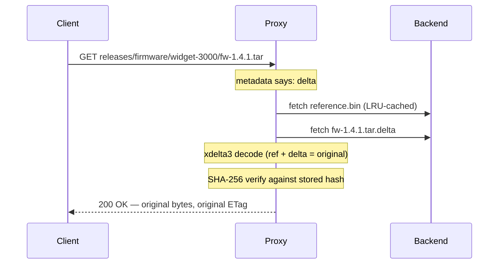

# How delta compression works

*Why storing every version of a binary is mostly waste, and what the proxy does about it.*

Picture the `releases` bucket at a firmware shop. A CI pipeline, authenticated as `ci-uploader`, pushes `firmware/widget-3000/fw-1.4.0.tar`, then `fw-1.4.1.tar` a week later, then `fw-1.4.2.tar`. Each tarball is tens of megabytes, and each is overwhelmingly identical to the one before it — a few changed source files, a version string, a build timestamp. Standard S3 stores every byte of every version, every time. That's the waste DeltaGlider exists to eliminate, and it does so without the client ever finding out.

## The core idea

The proxy stores the *difference* between versions instead of the versions themselves. The first delta-eligible upload into a prefix becomes the **reference baseline** for that prefix. Every later upload is run through xdelta3 — a binary diff tool — against that baseline, and if the diff is small enough, only the diff is stored.

So when `ci-uploader` pushes `fw-1.4.0.tar`, the proxy keeps it in full as the reference. When `fw-1.4.1.tar` arrives, xdelta3 compares it against the reference and produces a delta of perhaps 60 KB — the actual changed bytes plus bookkeeping. That 60 KB is what lands on storage. The client uploaded a full tarball and will download a full tarball; the proxy quietly stored less than one percent of it.


Two design choices matter here. First, every delta is computed **directly against the reference**, never against the previous delta. There are no delta chains, so reconstructing any version is always a single decode, and a corrupt delta can never cascade into its neighbours. Second, the baseline is **per-prefix**, not per-bucket. We call the unit a **deltaspace**: everything sharing the key prefix up to the last `/`. `firmware/widget-3000/` is one deltaspace with one `reference.bin`; `firmware/widget-9000/` would be another. This works because similar binaries tend to live together — a CI pipeline writes versions of the same artifact into the same folder. A bucket-wide baseline would force unrelated objects to diff against each other, which produces garbage deltas; a per-prefix baseline keeps the comparison local, where the similarity actually is, and keeps the blast radius of a bad reference to one folder.

## The PUT decision

Not everything should be delta-encoded, and the proxy decides per object. The file router looks at the extension first: archives, database dumps, tarballs, and similar version-prone formats are delta candidates; images, video, and other already-compressed media go straight to **passthrough** storage. There's no point diffing a JPEG — compression has already squeezed out the redundancy that a binary diff would exploit.

Even for an eligible file, the delta must earn its keep. If the encoded delta comes out at 75% or more of the original size (the `max_delta_ratio` guard, tunable), the proxy discards it and stores the object passthrough instead. A delta that barely saves space isn't worth paying reconstruction CPU on every future read. This guard is also the safety net for misclassified files: you don't need a perfectly curated extension list, because anything that doesn't actually delta well falls back automatically.

## The GET path, and why you can trust it

Reading a delta-stored object means rebuilding it:



The client sees a perfectly ordinary S3 response: the original `Content-Length`, the original ETag, preserved user metadata. The transparency is absolute by design — `ci-uploader`'s pipeline and anyone downloading firmware behave exactly as they would against plain S3.

The integrity story is what makes that transparency safe. On PUT, the proxy computes a SHA-256 of the original bytes and stores it in the object's metadata. On every delta GET, it recomputes the hash over the reconstructed bytes before sending anything. If they don't match — corrupted delta, corrupted reference, cosmic ray — the proxy evicts the cached reference and returns a 500. You may get an error; you will never get silently wrong bytes.

## What compresses well, and what honestly doesn't

The nightly Postgres dumps that `backup-bot` writes into `db-archive` are the ideal workload: large, structured, and mostly unchanged from one night to the next. Plain `.tar` archives of similar file trees are equally good. High-similarity workloads like these routinely see 60–95% savings.

Compressed archives need a more careful answer, and it's worth understanding why. A `.tar` of two similar source trees deltas beautifully. A `.tar.gz` of the *same* trees usually doesn't — because gzip compresses the whole stream as one continuous state machine, a one-byte change early in the archive perturbs the compressor's state and shifts the encoded bytes for everything after it. The payloads are similar; the compressed bytes are not, and xdelta3 can only see bytes. Container formats that compress members independently — `.zip`, `.jar`, `.docx` — sit in between and often delta well: a JAR where 20 of 500 classes changed still shares most of its compressed bytes with the previous build.

xdelta3 actually knows a trick for whole-stream formats: decompress, diff the payload, recompress on decode. We deliberately don't use it. The recompressed file could carry the same data with different bytes and a different checksum, and the proxy's contract is byte-exact — what you GET is bit-for-bit what you PUT. A format that only deltas well after semantic recompression is treated as a poor candidate and stored passthrough. Likewise the public installers in `downloads`, and any genuinely unique-per-upload content: the ratio guard quietly routes them to passthrough, and nobody has to configure anything.

## The trade-off: streaming versus buffering

Passthrough objects stream through the proxy in constant memory. Delta objects can't — xdelta3 is a batch algorithm, so reconstruction buffers the reference and the output in RAM, bounded by the max-object-size cap. That's the real price of the storage savings: delta reads cost memory and CPU that passthrough reads don't. The reference cache softens it considerably — the baseline for a hot deltaspace stays in an LRU cache, so only the first cold read pays a backend round-trip — but if your workload is huge objects read constantly and stored once, passthrough (or disabling compression on that bucket) is the better trade.

## What it looks like on the backend

The layout is the same whether the backend is a filesystem or S3 — deliberately boring:

```
releases/
  firmware/widget-3000/
    reference.bin            # internal baseline, seeded by fw-1.4.0.tar
    fw-1.4.1.tar.delta       # ~60 KB
    fw-1.4.2.tar.delta
    release-notes.txt        # passthrough, stored as-is
```

Per-object metadata (the SHA-256, sizes, which reference was used) rides along with each object — as extended attributes on the filesystem backend, as S3 user-metadata headers on S3 — so there are no sidecar files to drift out of sync.

## Why xdelta3, and why a subprocess

The codec shells out to the `xdelta3` binary rather than linking a library. This looks quaint and is entirely deliberate. It guarantees byte-exact compatibility with deltas produced by the original DeltaGlider Python toolchain, keeps C code out of the Rust binary, and makes every delta trivially debuggable: any `.delta` file on the backend can be decoded by hand with stock `xdelta3` on any machine. The per-object subprocess overhead — tens of milliseconds — is noise next to the network time of the upload itself.

## Related

- Tutorial: [Watch your first delta savings happen](../tutorials/first-delta-savings.md)
- How-to: [Set bucket compression and quotas](../how-to/set-bucket-compression-and-quotas.md)
- Reference: [Configuration](../reference/configuration.md) · [Metrics](../reference/metrics.md)
